# Agencia de coches → AutoManage

Sistema de gestión de flotas y empleados desarrollado con Django. Permite el control de vehículos, extras y empleados con una interfaz responsiva y segura.


## Tecnologías Utilizadas

* Backend: Django 4.2+, Python 3.13.

* Frontend: Bootstrap 5, Bootstrap Icons.

* Base de Datos: SQLite.

* Librerías: Pillow (para las fotos), django-humanize.


## Instalación (clonando el repositorio)

1. Clonar el repositorio: `git clone https://github.com/Makiflay86/AutoManage`

2. Nos metemos a su directorio: `cd AutoManage`

3. Instalar dependencias: `python -m pip install django pillow`.

4. Preparar la base de datos: `python manage.py migrate`.

5. Arrancar el servidor: `python manage.py runserver`.

6. Ejecución del servidor: http://127.0.0.1:8000/


## Modelos Principales

* **Coche**: Almacena información de los vehículos (marca, modelo, kilometros, combustible, etc.).

* **Empleado**: Gestiona los datos del personal (nombre, apellidos, puesto).

* **Extra**: Define accesorios o servicios adicionales que pueden asociarse a los vehículos.


## Seguridad

Para poder acceder al panel se necesita registrarse en la aplicación. Para ello se ha implementado un *`login`* y un *`register`* que hay que sobrepasar para acceder al dashboard.

Sin estar logueado no se puede hacer nada hasta que no te estes logueado.


## Capturas de pantalla

*   **Login**: Vista general del login.
<p align="center">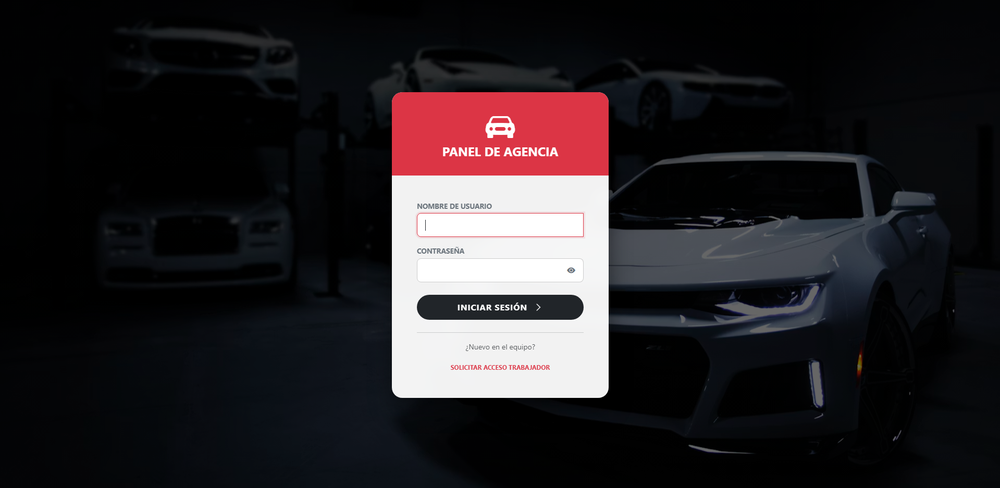</p>

*   **Register**: Vista general del register.
<p align="center">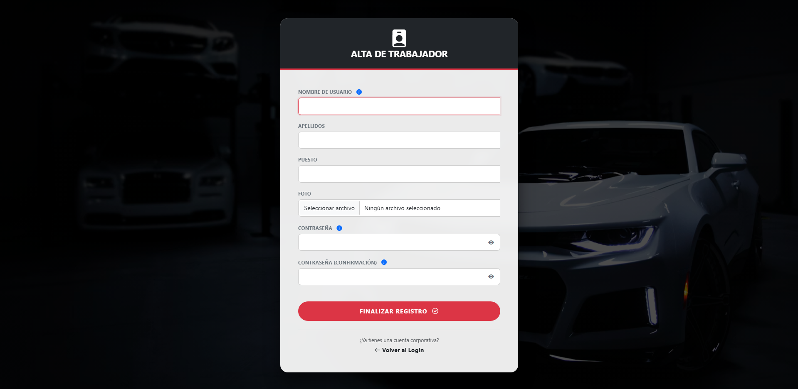</p>


*   **Dashboard**: Vista general de la flota y estadísticas.
<p align="center">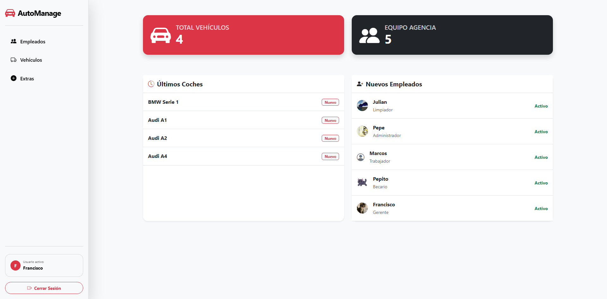</p>


*   **Gestión de Vehículos**: Listado detallado con opciones de filtrado.
<p align="center">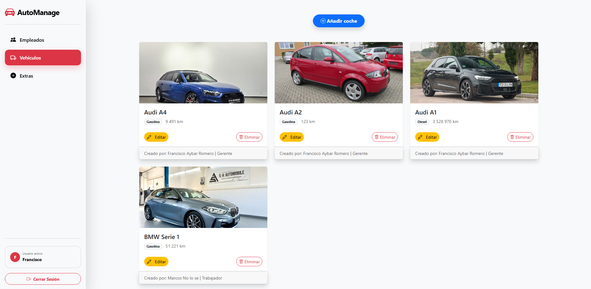</p>

*   **Gestión de Vehículos - Añadir**: Vista de añadir un coche, las imágenes se cargan dinámicamente.
<p align="center">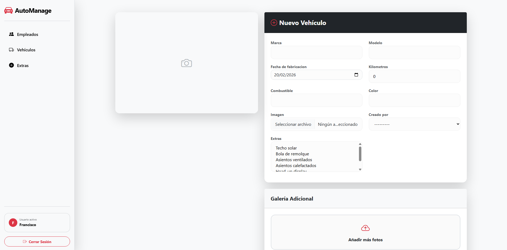</p>

*   **Gestión de Vehículos - Editar**: Vista de editar un coche, las imágenes se cargan dinámicamente.
<p align="center">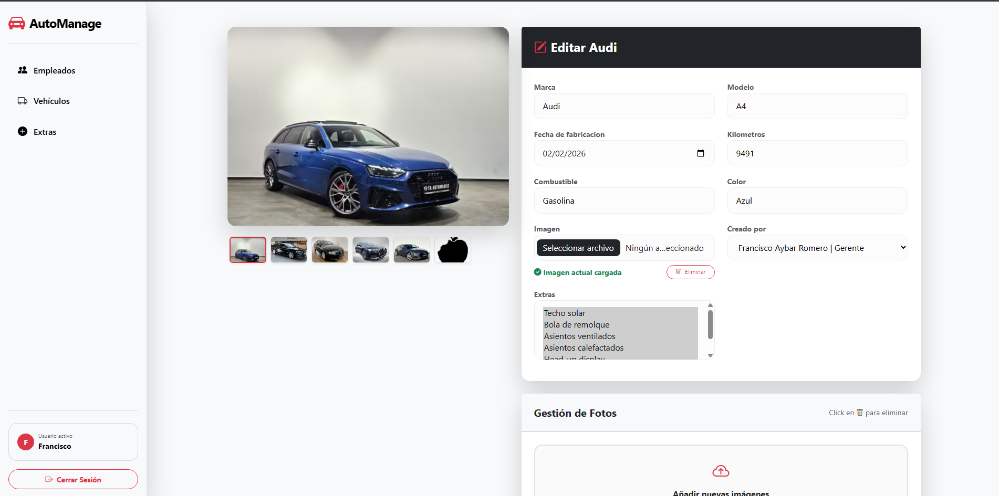</p>


*   **Panel de Empleados**: Control de acceso y roles del personal.
<p align="center">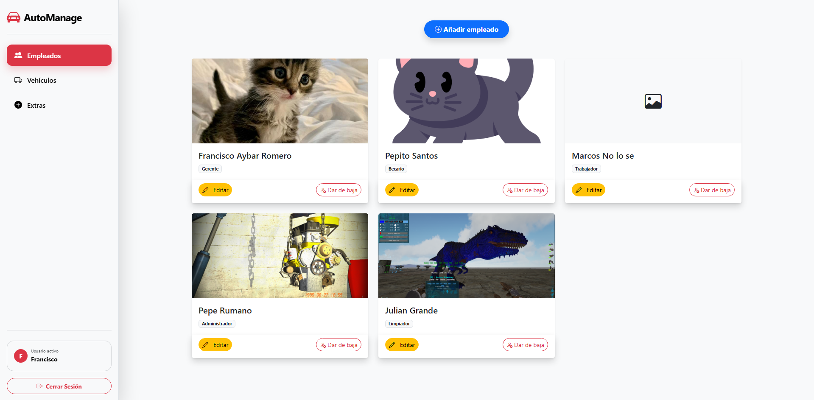</p>

*   **Panel de Empleados - Añadir**: Vista de añadir un empleado, la imágene se carga dinámicamente.
<p align="center">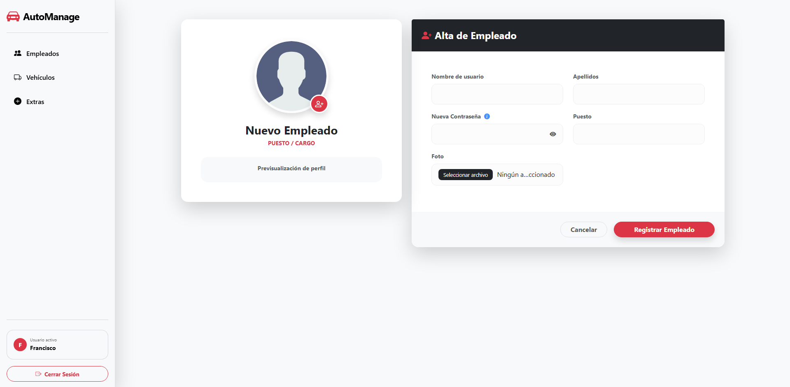</p>

*   **Panel de Empleados - Editar**: Vista de editar un empleado, la imágene se carga dinámicamente.
<p align="center">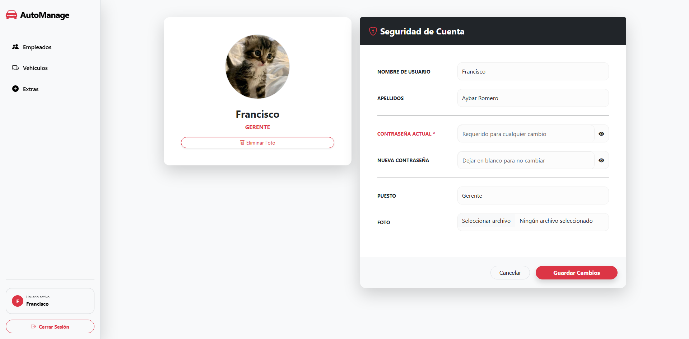</p>


*   **Panel de Extras**: Listado detallado de los extras que puede asignarse a un coche.
<p align="center">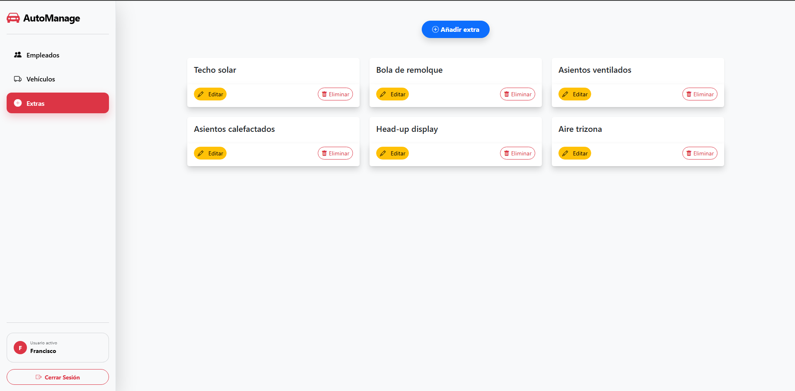</p>

*   **Panel de Extras - Añadir**: Vista de añadir un extra.
<p align="center">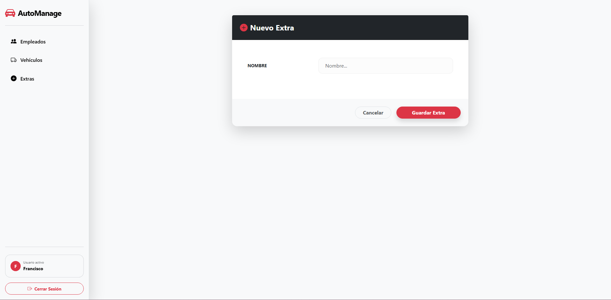</p>

*   **Panel de Extras  - Editar**: Vista de editar un extra.
<p align="center">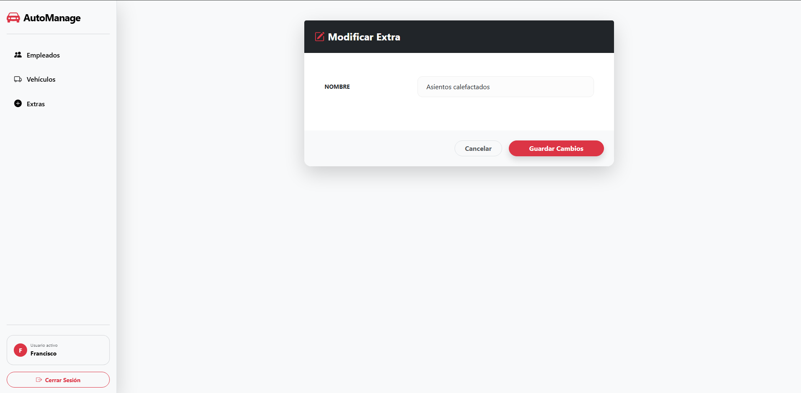</p>


## Instalación (paso a paso)

1. Es necesario instalar el motor de Django y la librería de procesamiento de imágenes (Pillow) de forma global en tu sistema: `python -m pip install django pillow`

2. Crear un proyecto: `python -m django startproject nombre_proyecto`

3. Acceder al proyecto: `cd nombre_proyecto`

4. Crear nuestra app: `python manage.py startapp nombre_app`

5. Vamos a nombre_proyecto/setting.py y damos de alta nuestra proyecto:
<p align="center">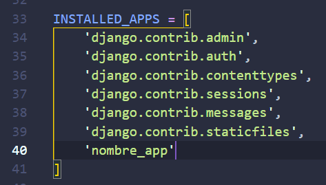</p>

6. Creamos las views, views.py:
<p align="center">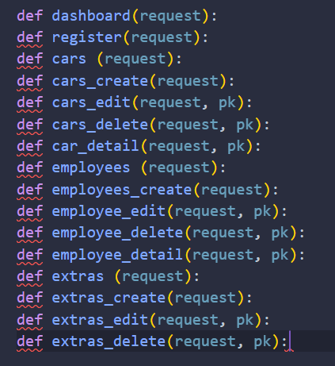</p>

7. Creamos los modelos, models.py: 
<p align="center">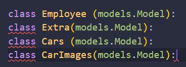</p>

8. Creamos los urls, urls.py:
<p align="center">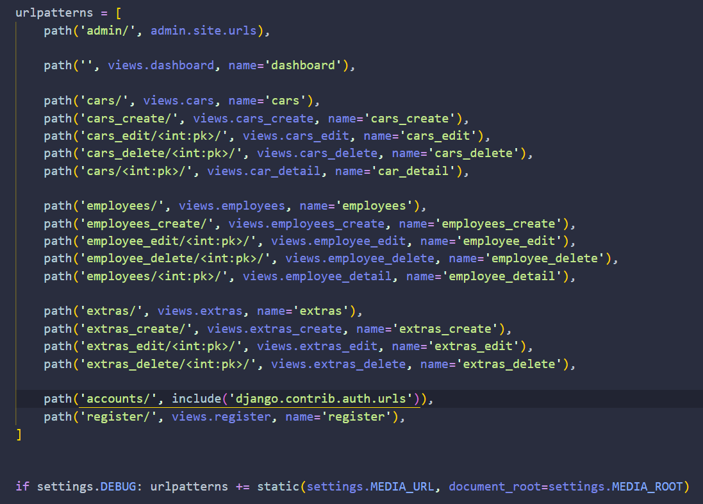</p>

9. Registramos los modelos en admin.py
<p align="center">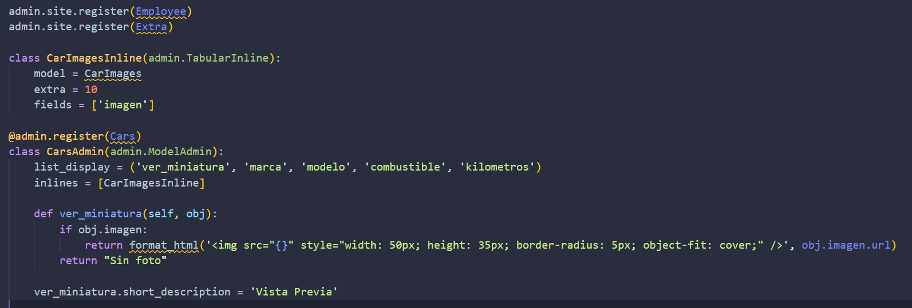</p>

10. Preparamos la migracion: 
<p align="center">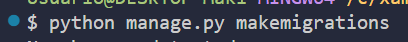</p>

11. Hacemos la migracion: 
<p align="center">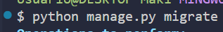</p>

12. Hay que ir a settings.py y decir que los TEMPLATES es en la carpeta templates
<p align="center">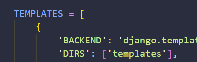</p>

13. Creamos el super usuario, para ello pondremos en la terminal
<p align="center">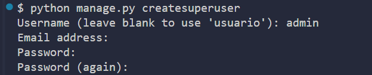</p>

14. Para poder ver los km con separación entre los miles hay que activar en settings.py dentro de INSTALLED_APPS esto:
<p align="center">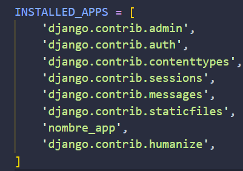</p>

15. Para mostrar las imágenes usaremos la url, para ello hay que crear la carpeta media en la raíz y después ir a settings.py y poner al final del todo esto:
<p align="center">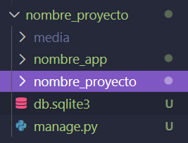</p>
<p align="center">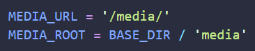</p>

16. Para tener externos los css, js, etc, hay que crear la carpeta static y después ir a settings.py y poner al final del todo esto:
<p align="center">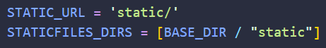</p>
<p align="center">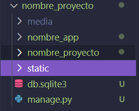</p>

17. Para luego el login, logout, debemos de poner esto al final de settings.py:
<p align="center">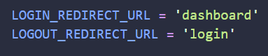</p>

18. Ahora podemos crear todos los templates necesarios, empezaremos por el index.html que contendrá todo el codigo que luego se extendera a los demás, tambien contendrá nuestro sidebar, estará en la raíz de templates que deberemos de crear ubicada en nuestra app:
<p align="center">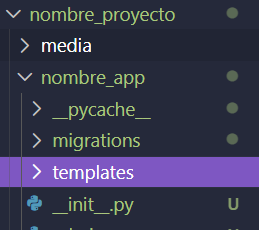</p>
<p align="center">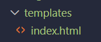</p>

19. Proseguimos con los demas modelos que yo lo separo en sus tipos: <br>> Nota: El dist es de una extensión mia, este no hay que crearlo.
<p align="center">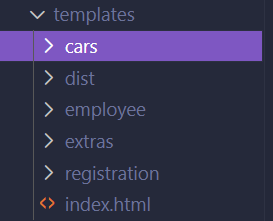</p>
<p align="center">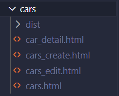</p>
<p align="center">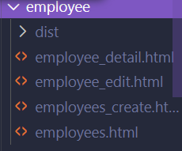</p>
<p align="center">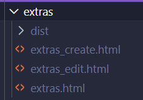</p>
<p align="center">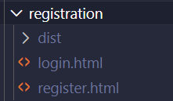</p>


## Explicación detallada sobre los modelos

### Cars

Para poder tener el registro de los coches, almacenaremos su marca, modelo, kilometros, etc.

En este caso podemos observar que creamos la clase `Cars()` donde se le crea un atributo `marca` que se le asgina **CharField** (texto o varchar), **verbose_name** (el nombre que se verá la llamarlo), **max_length** (tamaño máximo) y **default** (por defecto será '', que es igual a nada)
```python
    # Tabla coches
    class Cars (models.Model):

        # Marca (ej: Audi)
        marca = models.CharField (
            verbose_name = 'Marca', 
            max_length = 100,
            default = ''
        )
```

### Employee

Para poder tener el registro de los empleado, almacenaremos su nombre, apellido, puesto, etc.

En este caso podemos observar que creamos la clase `Employee()` donde se le crea un atributo `user` que se le asgina **OneToOneField** (vincular un modelo con otro), **User** (usuario del login), **on_delete = models.CASCADE** (si se borra el usuario, se borra todo lo demás), **null = True** (puede ser nulo) y **blank = True** (puede ser nulo en los formularios)
```python
    # Tabla empleado
    class Employee (models.Model):

        user = models.OneToOneField(
            User, 
            on_delete = models.CASCADE, 
            null = True, 
            blank = True
        )
```

### Extra

Para poder tener el registro de los extras, almacenaremos su nombre.

En este caso podemos observar que creamos la clase `Extra()` donde se le crea un atributo `nombre` que se le asgina **CharField** (texto o varchar), **max_length** (tamaño máximo) y **default** (por defecto será '', que es igual a nada)
```python
    # Tabla extra (ej: techo solar)
    class Extra(models.Model):

        nombre = models.CharField(
            max_length = 100,
            default = ''
        )
```

### CarImages

Para poder tener el registro de las imágenes adicionales de los coches, almacenaremos la id del coche y su ruta de la imagen.

En este caso podemos observar que creamos la clase `CarImages()` donde se le crea un atributo `car` que se le asgina **ForeignKey** (clave foránea), **Cars** (modelo Cars), **on_delete = models.CASCADE** (si se borra el usuario, se borra todo lo demás) y **related_name = 'imagenes_adicionales'** (atajo en el modelo Cars, en vez de usar el nombre por defecto)
```python
    # El resto de imágenes de los coches
    class CarImages(models.Model):

        # Relación con la tabla Cars
        car = models.ForeignKey (
            Cars, 
            on_delete = models.CASCADE, 
            related_name = 'imagenes_adicionales'
        )
```


## Capturas de pantalla

*   **Login**: Vista general del login.
<p align="center"></p>

*   **Register**: Vista general del register.
<p align="center"></p>


*   **Dashboard**: Vista general de la flota y estadísticas.
<p align="center"></p>


*   **Gestión de Vehículos**: Listado detallado con opciones de filtrado.
<p align="center"></p>

*   **Gestión de Vehículos - Añadir**: Vista de añadir un coche, las imágenes se cargan dinámicamente.
<p align="center"></p>

*   **Gestión de Vehículos - Editar**: Vista de editar un coche, las imágenes se cargan dinámicamente.
<p align="center"></p>


*   **Panel de Empleados**: Control de acceso y roles del personal.
<p align="center"></p>

*   **Panel de Empleados - Añadir**: Vista de añadir un empleado, la imágene se carga dinámicamente.
<p align="center"></p>

*   **Panel de Empleados - Editar**: Vista de editar un empleado, la imágene se carga dinámicamente.
<p align="center"></p>


*   **Panel de Extras**: Listado detallado de los extras que puede asignarse a un coche.
<p align="center"></p>

*   **Panel de Extras - Añadir**: Vista de añadir un extra.
<p align="center"></p>

*   **Panel de Extras  - Editar**: Vista de editar un extra.
<p align="center"></p>


## Autor

*   **Makiflay86 | Francisco** - *Desarrolador de aplicaciones web*
